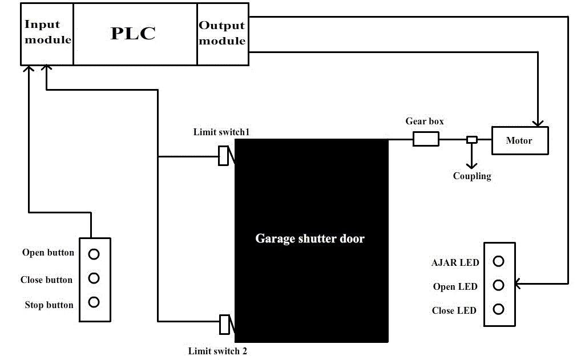
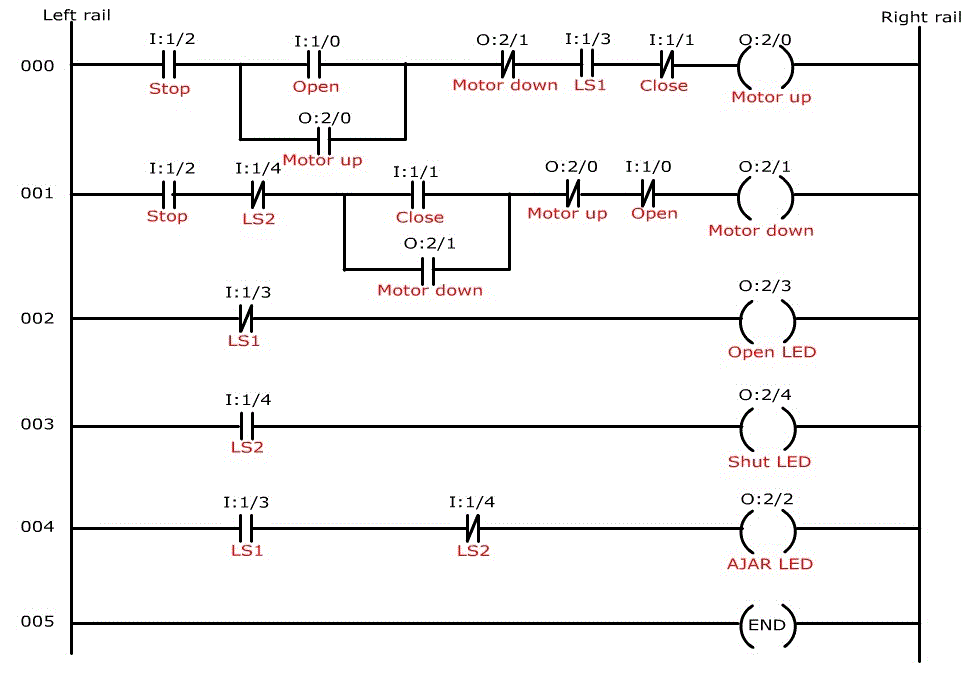
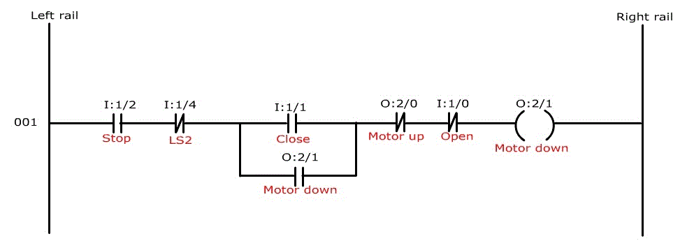
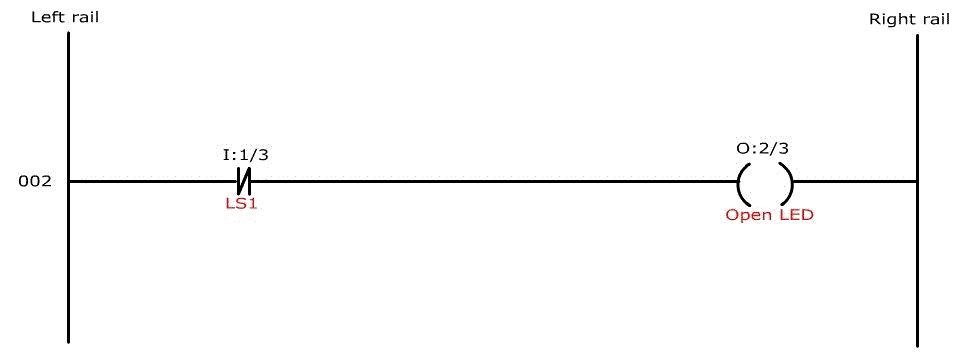
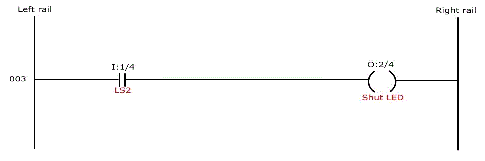
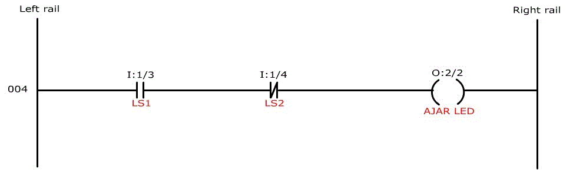
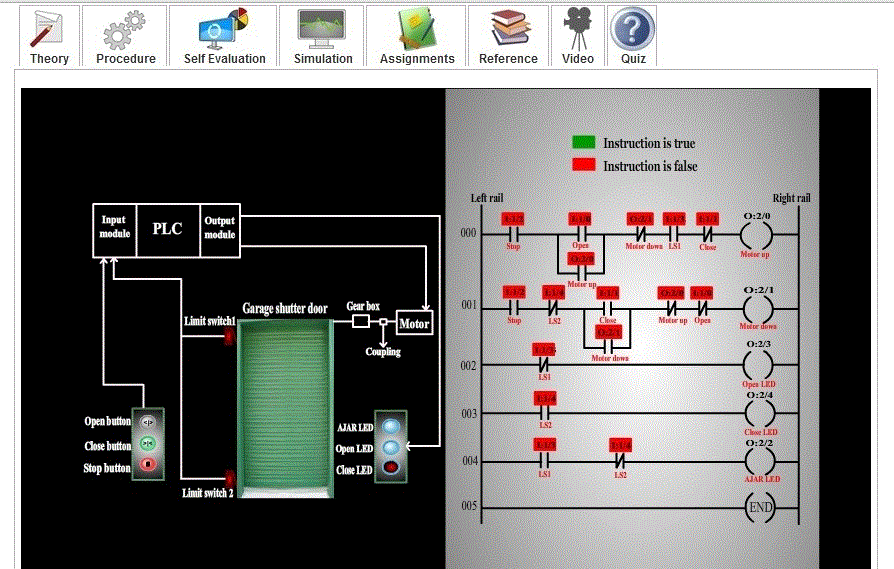
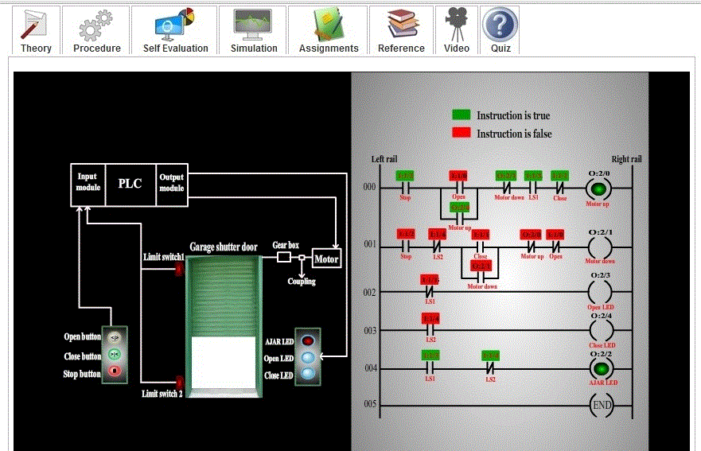
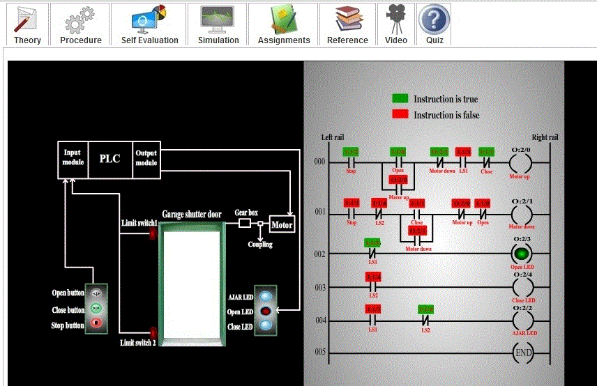

### Aim of the experiment: Garage shutter opening and closing using PLC

<u><strong>Aim</u> : </strong>
Garage shutter opening and closing using PLC.

### Procedure :

<strong>Procedure :</strong> For the purpose of opening and closing of garage door shutter,
we need motor, limit switch, push button, coupling, light emitting diode, shaft and gear box. 
Let us see the basic diagram of the circuitry.

The PLC is used here to take input from the user, whether to open door, close door or just stop either of the action .It gives signal to the motor to open or close the shutter accordingly. Limit switches are used to determine the extreme position of garage shutter. This signal is a form of input to the PLC. Limit switch1 is used to identify the upper limit of the garage shutter i.e. when garage shutter is fully open. Limit switch2 is used to identify the lower limit of the garage shutter i.e. when garage shutter is fully closed.

##### Steps to design the process :
<ul type=disc style="text-align: justify;">
<li>Choose a shaft of proper strength to withstand the weight of the garage shutter and notice its diameter.</li>
<li>Calculate the torque required to pull the garage shutter.</li>
<li>Calculate the torque of the motor used to pull the garage shutter.</li>
<li>Use the equation,  
Motor torque * gear ratio = Torque to pull garage shutter--(1) 
Find the required Gear ratio from the above equation.</li>
<li>Design the required ladder logic for the process.</li>
</ul>

#### Design specification :
<ul type=disc style="text-align: justify;">
<li>Assuming we have a garage shutter of 9*9 feet and weighing about 100 kg. Also, taking 1.5kw *2800 rpm synchronous
ac motor.</li> 

<li><u>Torque required to pull the garage shutter</u> 
Assuming the shaft to be of 2.4cm diameter , or radius of  1.2cm. 
	     We know, Torque = Force*distance, 
&nbsp;&nbsp;&nbsp; &nbsp; &nbsp; &nbsp; &nbsp; &nbsp; &nbsp; &nbsp; &nbsp; &nbsp; &nbsp; &nbsp; &nbsp; &nbsp;= (Mass*acceleration)*distance 
&nbsp;&nbsp;&nbsp; &nbsp; &nbsp; &nbsp; &nbsp; &nbsp; &nbsp; &nbsp; &nbsp; &nbsp; &nbsp; &nbsp; &nbsp; &nbsp;= (100kg*10m/s2)*(1.2*10-2m) 
&nbsp;&nbsp;&nbsp; &nbsp; &nbsp; &nbsp; &nbsp; &nbsp; &nbsp; &nbsp; Torque = 12 N-m</li> 

<li><u>Torque produced by motor</u> 
     Torque of motor = {Power (kW)*60000} / {2*3.14*rpm} 
&nbsp;&nbsp;&nbsp; &nbsp; &nbsp; &nbsp; &nbsp; &nbsp; &nbsp; &nbsp; &nbsp; &nbsp; &nbsp; &nbsp;&nbsp;= (1.5*60000)/ (2*3.14*2800) 
&nbsp;Torque of motor = 5.118 N-m</li>
</ul> 

#### Ladder logic design </strong></u>

Now, let us see how the ladder logic of the garage shutter (shown below) is implemented in a PLC.

 

 

##### Our assumption:
<ul type=disc style="text-align: justify;">
<li>Open push button used is normally open, close push button used is normally open and stop push button used is normally closed.</li> 
<li>Limit switch1 (LS1): not activated (false) when door is fully opened, else activated (true).</li> 
<li>Limit switch2 (LS2): activated (true) when door is fully closed, else not activated (false).</li> 
<li>Since inputs and outputs are less, 8-point I/O module PLC is sufficient, where CPU resides in slot 0, input module resides in slot1, and output module resides in slot2. </li> 
<li>Let us assign address for the input and output signals of the PLC. 

<ul type=square>
<li>Open(push button):   I:1/0</li> 
<li>Close(push button):   I:1/1</li> 
<li>Stop(push button):   I:1/2</li> 
<li>LS1:   I:1/3</li> 
<li>LS2:   I:1/4</li> 
<li>Motor up : O:2/0</li> 
<li>Motor down: O:2/1</li> 
<li>AJAR LED: O:2/2</li> 
<li>Open LED: O:2/3</li> 
<li>Shut LED: O:2/4</li> 
</ul>
</li>
<li>Let us see its ladder logic program: 

 

 The above ladder logic program has 5 rungs , let us see the functions of each rung individually:
</li>
</ul>

#### Rung 000 : 

The above rung is used to open the garage shutter. The above rung passes logical continuity, when open push button is pressed. It will pass logical continuity as long as stop or close push button is not pressed. It will pass logical continuity as long as door is not fully opened. The moment door is fully opened the motor is de-energized. Since open switch used is a push button, it has to be latched.

#### Rung 001 : 

The above rung is used to close the garage shutter. The above rung passes logical continuity, when close push button is pressed. It will pass logical continuity as long as stop or open push button is not pressed. It will pass logical continuity as long as door is not fully closed. The moment door is fully closed the motor is de-energized. Since close switch used is a push button, it has to be latched.

#### Rung 002 : 

The above rung is used to indicate open condition of the garage shutter. When the garage shutter is fully opened, the signal from the Limit switch1 (LS1) is false i.e. 0 is sent to the corresponding input status file i.e. input screw terminal 3, has 0 in its corresponding input status file bit location. Thus open LED will be energized. 

#### Rung 003 : 

The above rung is used to indicate shut condition of the garage shutter. When the garage shutter is fully closed, the signal from the Limit switch2 (LS2) is true i.e. 1 is sent to the corresponding input status file i.e. input screw terminal 4, has 1 in its corresponding input status file bit location. Thus shut LED will be energized. 

#### Rung 004 : 

AJAR LED is used to indicate that the garage shutter is not in its extreme positions i.e. it is not completely closed or completely open. In other words, it is in between of two extreme positions. When the garage shutter is fully opened, the signal from the Limit switch1 (LS1) is false i.e. 0 is sent to the corresponding input status file i.e. input screw terminal 3, has 0 in its corresponding input status file bit location. Hence, the normally open instruction becomes false and logical continuity is lost. As a result AJAR LED is de-energized. When the garage shutter is fully closed, the signal from the Limit switch2 (LS2) is true i.e. 1 is sent to the corresponding input status file i.e. input screw terminal 4, has 1 in its corresponding input status file bit location. Hence, the normally closed instruction becomes false and logical continuity is lost. As a result AJAR LED is de-energized. So, only when the garage shutter is in between of the two extreme positions, logical continuity is passed and AJAR LED is energized.

##### The following screen shots represents the operation:
<ul type=disc style="text-align: justify;">
<li> 

 

 The above screen shot represents the condition when the Garage shutter is completely closed.
 </li>

<li> 

 

 The above screen shot represents the condition when the Garage shutter is in intermediate stage i.e. can be opening or closing.
 </li>

<li> 

 

 The above screen shot represents the condition when the Garage shutter is completely opened.
</li>
</ul>
