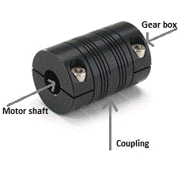
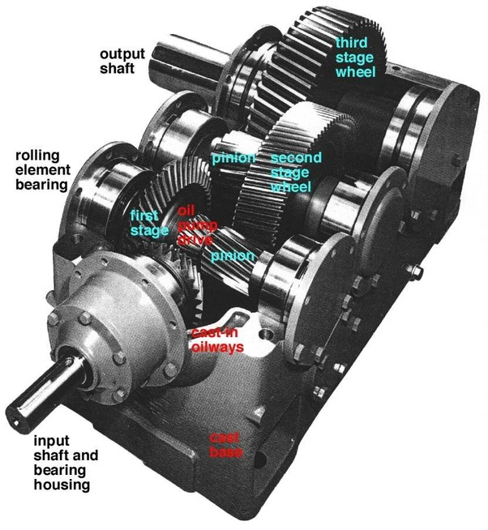
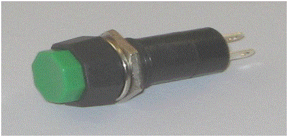

### Introduction

In order for the garage shutter to open or close , we need certain instruments like motor, coupling, gear box, shaft, limit switches ,chain or belt ,light emitting diode(LED),push buttons (N.O and N.C) and PLC.

Let us see some of the instruments used in detail:

#### Motor :

Motor is required to produce the torque and power required to pull the garage shutter. For this purpose we can make use of either DC or AC motor. As the speed with which the garage shutter door is opened is preferably constant, we can make use of AC motor. A single phase AC motor, which is also known as general purpose motor would be sufficient.

#### Coupling :

A coupling is a device used to connect two shafts together at their ends for the purpose of transmitting power. Here in our case , we are using to connect shaft of the motor to gear box.

 

#### Gear box :

Gear box is a device that uses gears and gear trains to provide speed and torque conversions from a rotating power source to another device. In simple words it can be used to increase or decrease speed or decrease or increase torque.

 
 

#### Light emitting diode :

Light emitting diodes are used to indicate the states of the garage shutter, whether it is closed, opened or in between.

#### Limit switch :

A limit switch is a type of switch used to stop the motion of a machine slide (or in our case garage door) or element once it reaches a fixed point.

 

#### Working of a limit switch :

The basic limit switch has a spring-loaded push button connected to an electric circuit. When the push button (actuator) is pushed inside it trips or actuates the electrical circuit. The electrical circuit then signals a machine element to stop or start its motion. Once the pressure on the push button is removed, it comes back to its original position and is ready for the next cycle.

#### Selection of limit switch :

Limit switches are classified based on their actuating mechanism and application. The types of limit switches are many and some of them are: - linear limit switch, programmable limit switch, plunger limit switch, limit micro switch etc. Other types of limit switches are called optical proximity switches or magnetic proximity switches. Optical proximity switches utilize two different components. One component emits an infra-red light beam to a receiver mounted at a straight distance away. If the light beam is broken, the optical proximity limit switch will open, “turn off" or close, “turn on" a circuit to switch the electrical power. A magnetic proximity limit switch is a singular device that will also turn on or turn off  when it comes close to a piece of metal. Regardless of the types or sizes of limit switches, these devices can only accomplish a task of a activation or deactivation.

##### Application :

Limit switches are very commonly used devices. For example :

<ol type="1" style="text-align: justify;">
<li>Turning OFF of the light, when the refrigerator door is closed.</li>
<li> Switching ON of car's dome lights when we open the door.</li>
<li>Stopping of the washing machine when load becomes unbalanced.</li>
<li>Limit switch are also used in scissor lifts, conveyor systems, transfer machines, material packing and handling equipment, elevators, escalators, general safety equipment etc.</li>
</ol>

#### Push button :

Push button is a kind of a switch which is activated or deactivated the moment we press or depress it. It sends a signals momentarily when we press or depress it.

